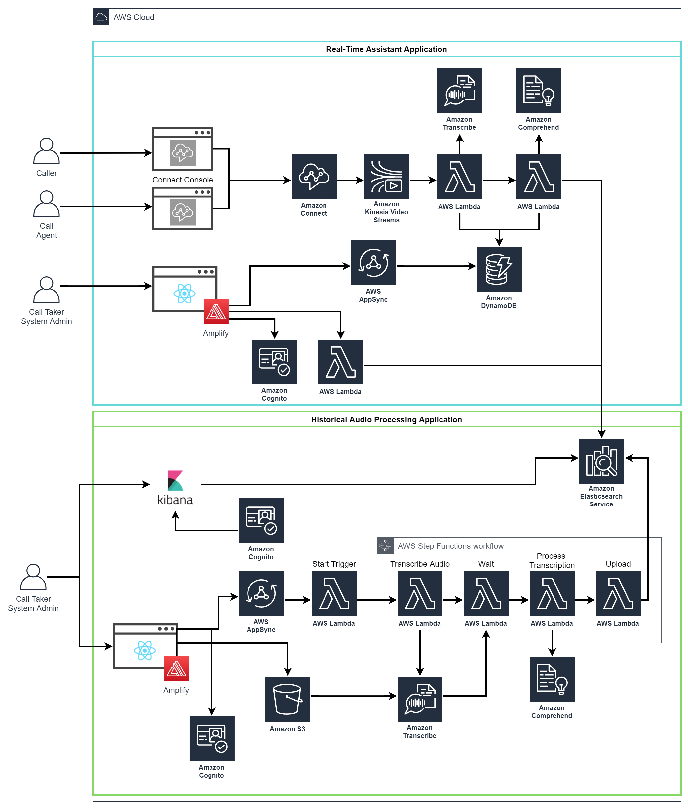

# Call Center Virtual Assistant - Historical Audio Processing Repository

## Project Summary

The Call Center Virtual Assistant tool serves to assist non-emergency call takers in identifying the nature and 
scenario of incoming calls and moving ahead with the correct standard procedures, leading to increase in overall 
efficiency and accuracy in call-taking. Procedure recommendations are based on keyphrase similarity in ElasticSearch 
between the currently transcribed call and transcripts of audio call files provided by the user.

**This repository contains the first part of the entire application stack, the
 *historical audio processing tool*.**

## High-level Architecture

## Stack Documentation and Deployment Guides

[Audio Processing Backend Stack Deployment](docs/backend-README.md) \
[Audio Processing Frontend Stack Deployment](docs/frontend-README.md) \
[Real-Time Assistant Backend Stack Deployment](https://github.com/UBC-CIC/call-center-real-time-assistant/blob/main/docs/backend-README.md) (points to the real-time assistant repository)\
[Real-Time Assistant Frontend Stack Deployment](https://github.com/UBC-CIC/call-center-real-time-assistant/blob/main/docs/frontend-README.md) (points to the real-time assistant repository)

## Credits
This prototype was coded and architected by Colin Zhang, with guidance from the UBC CIC tech and project teams 
and with quoted usage and reference to some AWS sample template projects. The prototype was further refined by 
Neelim Novo and Sathvik Radhakrishnan, with the addition of the Real-Time Assistant User Interface being designed and developed by them. 

## License
This project is distributed under the [MIT License](./LICENSE).
