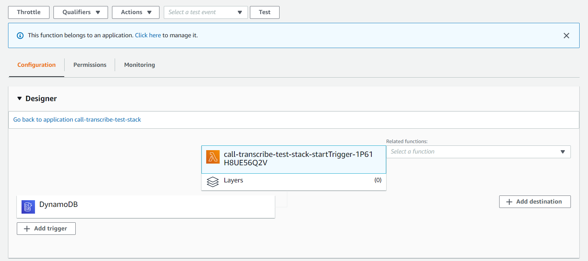
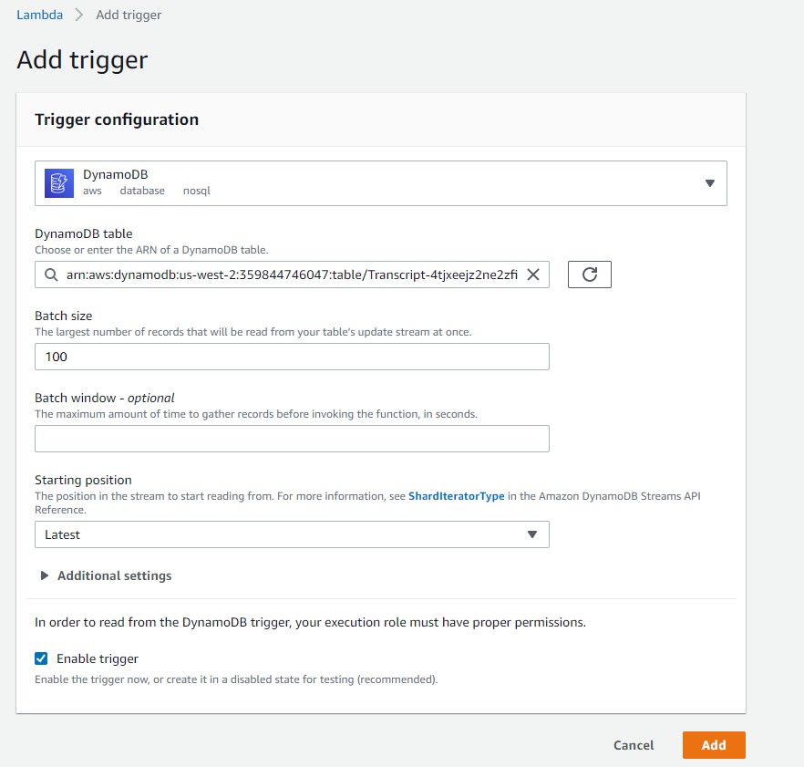
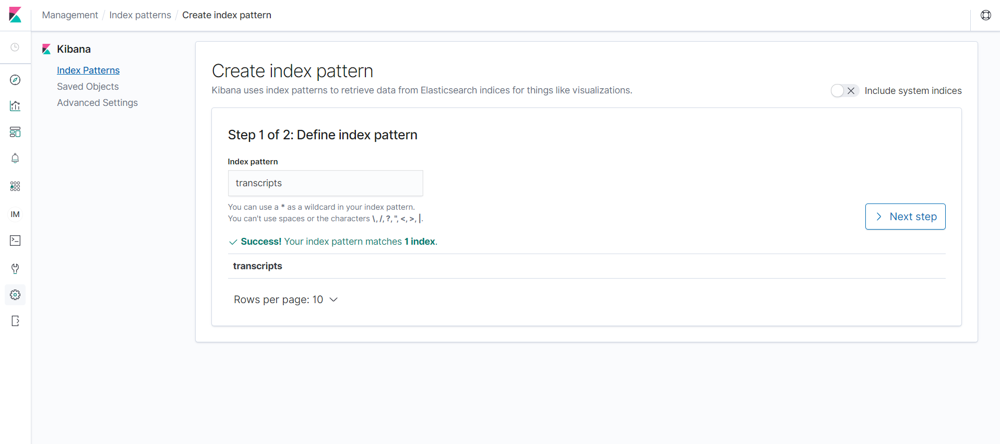
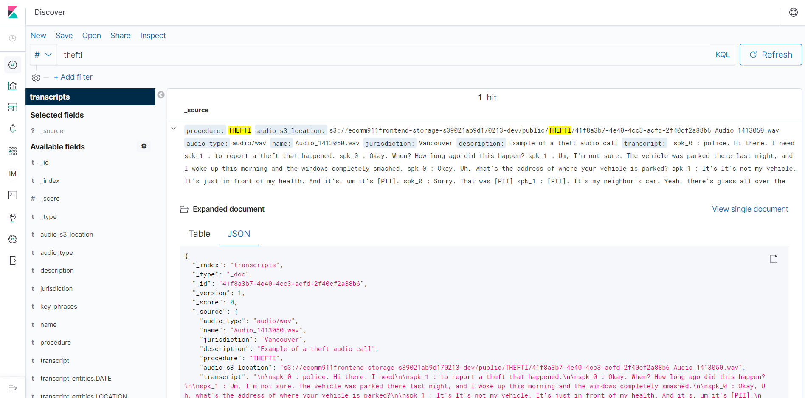
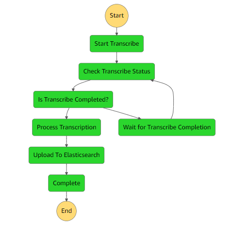

# E-Comm 911 - Historical Audio Processing (Part 1)

## Project Overview

The first half of the E-Comm 911 call center virtual assistant Proof of concept - an application stack that transcribes 
and provides PII redaction for audio files and their corresponding metadata received from the frontend, and indexes the 
resulting processed transcripts into an Elasticsearch domain for future querying during ongoing calls. This portion of 
the solution leverages Amazon Transcribe, Amazon Comprehend, Amazon Elasticsearch, AWS Step Functions and AWS Lambda. 
Do note that this stack should be deployed first as the real-time assistant stack with AWS Connect Integration 
has a dependency on this stack.

## Deployment Steps

Some system requirements before starting deployment:
* AWS SAM installed on your system, details on the installation can be found 
  [here](https://docs.aws.amazon.com/serverless-application-model/latest/developerguide/serverless-sam-cli-install.html).
* Python3.8 installed and added to PATH (you can select this in the installer), download the 
  installer [here](https://www.python.org/downloads/release/python-387/). 
  Run ```pip install wheel``` in the command line if there are any issues with ```sam build``` resolving dependencies.

1) Create an S3 bucket for deployment:
```
aws s3api create-bucket --bucket <YOUR-BUCKET-NAME> --create-bucket-configuration LocationConstraint=<YOUR-REGION> --region <YOUR-REGION> --profile <YOUR-PROFILE>
```
NOTE: If using region us-east-1, remove the entire `--create-bucket-configuration LocationConstraint=<YOUR-REGION> --region <YOUR-REGION>`section

2) Run the following SAM commands in this subdirectory (i.e `ecomm911-virtual-assistant/historical-audio-processing-backend`) 
   to build and package the application onto the created S3 bucket in the first step:
```
sam build
```
```
sam package --s3-bucket <YOUR-BUCKET-NAME> --output-template-file out.yaml --profile <YOUR-PROFILE>
```
3) Run the following SAM command to deploy the application. You can add the optional ```--guided``` flag for AWS SAM to 
   provide step-by-step prompts for the deployment process. The stack will take some time to
   finish deployment, due to creating the Elasticsearch cluster.:
```
sam deploy --template-file out.yaml --stack-name <STACK-NAME> --capabilities CAPABILITY_IAM CAPABILITY_NAMED_IAM CAPABILITY_AUTO_EXPAND --profile <YOUR-PROFILE> --region <YOUR-REGION> --guided
```
4) Now follow the [frontend](../audio-processing-frontend/README.md) deployment guide and then move on to the
   next step. Navigate to the Lambda Console and search for the startTrigger lambda function that was created in 
   the stack. Click on **Add Trigger** in the Designer under the **Configurations** Tab:

5) Select **DynamoDB** as the trigger type and select the Transcript table created from frontend deployment from the 
   dropdown. Check the **Enable trigger** checkbox at the bottom and click **Add** to create the trigger.


Now, refer to the [Real-Time Assistant Stack deployment guide](../real-time-assistant-backend/README.md) for the next
step.

## Accessing Kibana

You can use Kibana as a search and visualization tool for your Elasticsearch cluster that stores the call transcripts. 
The Kibana access URL and account credentials (specified username from the stack, and an auto-generated password) will 
be found in the Output tab for the CloudFormation stack once deployment is completed.

1) Click on the Kibana URL and use the given credentials to login. Note that you have to specify a new password when 
   logging in for the first time.
2) Click on **Discover** (The compass icon on the left sidebar) and type 'transcripts' in the index pattern field, and 
   this should match the index created in the Elasticsearch cluster. Click on **Create Index Pattern** in the next step.

3) You will be taken to the management screen where you can view all the fields in the ```transcripts``` index. 
   Navigating back to the **Discover** panel, you will be able to view all the indexed documents and perform queries in the search bar.


## State Machine Architecture


This workflow is designed to integrate with the frontend architecture; the state machine is invoked by the `start_trigger.py` lambda function,
which is triggered by insert events into the `Transcripts` DynamoDB table by the Amplify API, which contains metadata for the audio 
file that was uploaded to Amplify Storage.
Note that the supported audio file types are: .wav, .mp3, .mp4, and .flac.
* In the `Start Transcribe` step, a transcription job for the uploaded audio file will be started with Personally Identifiable Information
  redaction (PII) enabled.
* 'Check Transcribe Status' will check if the Transcribe job is finished and only then it advances to `Process Transcription`.
  Otherwise, it waits for 60 seconds until it loops to check again
* The resulting transcript is available via URI instead of being written to an S3 bucket. In the `Process Transcription` 
  step, the transcript will try to be chunked up according to speaker, and will key phrase extraction.
* Finally, the transcript, phrases and other metadata will be indexed into the ES cluster in the `Upload To Elasticsearch` step.

## Future Development Considerations

This is a proof of concept for E-Comm 911 done by the UBC CIC. The project may be further refined in certain ways
* Implementing batch audio upload via API calls for better scalability.
* Custom vocabularies can be implemented to refine transcription accuracy for jargon/buzzwords. It only needs to be
  inserted as a dictionary in `process_transcription_full_text.py`, the word substitution functionality is already
  implemented.
* The transcription accuracy can further be improved by using a custom-language model for Amazon Transcribe that 
  has to be built using domain-specific text or audio files with their respective highly-accurate transcripts.
* The configured concurrency 

## Credits

This portion of the proof of concept was based on and modified from 
the [Amazon Transcribe Comprehend Podcast Project](https://github.com/aws-samples/amazon-transcribe-comprehend-podcast) 
by the team at the UBC Cloud Innovation Centre.