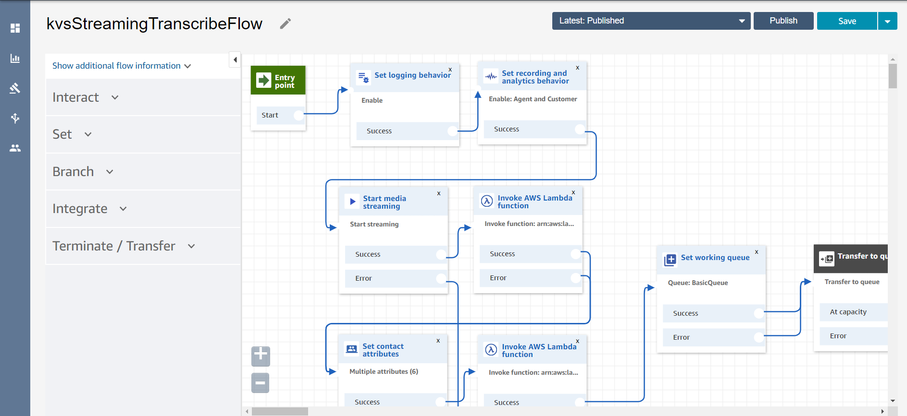

# ECOMM 911 Virtual Assistant (Part 2)

## Project Overview
The second half of the ECOMM-911 call center virtual assistant proof of concept - this stack initializes the resources that receives and transcribes the incoming caller and call taker audio from the AWS Connect instance in real time, and queries the results against the Elasticsearch Cluster deployed in the previous stack to retrieve the most appropriate Standard Operating Procedure for based on document similarity. This portion of the solution leverages Amazon Connect, Amazon Transcribe, Amazon Comprehend, AWS Lambda DynamoDB, and (indirectly) Amazon Kinesis Video Streams.

## Deployment Steps
1) Create an S3 bucket, or re-use the same bucket you created in the previous stack.
2) Setup an instance of Amazon Connect from the AWS console. Details on instance creation can be found [here](https://docs.aws.amazon.com/connect/latest/adminguide/tutorial1-create-instance.html). Note that Amazon Connect is currently unavailable in the ca-central-1 AWS region. Both backend stacks must be deployed in the same account and region.
3) In that same created instance, enable live media streaming so that it supports the start/stop media streaming contact flow blocks that are required in the contact flows. Instructions for enabling this can be found [here](https://docs.aws.amazon.com/connect/latest/adminguide/enable-live-media-streams.html).
4) Clone the git repository if you haven't already, and upload the deployment/ folder in this subdirectory into the S3 bucket to be used for deployment. Open the ```template.yaml``` file and copy the object URL.
5) From CloudFormation in the AWS Console, Select **With new resources (standard)** under the **Create Stack** dropdown. Then, select the **Amazon S3 URL** option under **Template Source** and paste the URL.
6) Specify a unique stack name and the name of the bucket used to store the starter contact flow.
7) Provide the name of the ES domain deployed from the earlier stack; there is no need to do this if you kept the original default values. Specify the name of the deployment and the path to the lambda deployment packages in ```existingS3BucketName``` and ```existingS3Path``` respectively (if you uploaded the folder into the bucket then ```existingS3Path``` should be ```deployment/```).
8) Click **Create Change Set** and then **Execute**, and wait for the stack to finish deployment.
9) A new S3 bucket will be created during deployment and will contain a sample contact flow to be imported into AWS Connect. Navigate to the newly created S3 bucket and download the contact flow, which is essentially a JSON file.
10) Login to your AWS Connect instance. Select **Contact Flows** under Routing on the left sidebar, and click on **Create Contact Flow**.

11) Select **Import flow (beta)** under the Save dropdown and select the downloaded file. Save and publish.

12) Select **Phone numbers** under the Routing on the left sidebar, then click **Claim a number**. Select a number (or use a ported phone number) and select the recently created contact flow under Additional Options and press **Save** to map the contact flow to the number. Calling the number will trigger the contact flow and start transcription.


Contact flows define flow logic in AWS Connect; the sample contact flow created during deployment has all the functionality needed to initialize audio streaming and trigger the transcribe lambda function and the rest of the workflow. The caller is transferred to a basic queue as default behaviour after triggering, so handling incoming callers is expected to be customized and integrated according to the user's needs.

## Build Steps
CloudFormation and build infrastructure was mostly kept from the original template project. Lambdas for helper functions were pre-packaged, and Gradle is needed to build the java lambda function responsible for the real time transcription; Instructions to install Gradle can be found [here](https://gradle.org/install/). Running ```gradle build``` will build the dependencies specified in the build.gradle file with the java lambda code and zip it up into a package, found in the ```build/distributions``` folder after building.

## Project Architecture
* The main java lambda function is located in the ```src/``` folder. It takes in metadata from Kinesis Video Streams and Connect, as well as some parameters defined within the contact flow which can be modified. The transcription starts when ```TranscribeStreamingRetryClient``` class calls ```startStreamTranscription```, and the function will run asynchronously and send segments of audio to AWS Transcribe. When transcript segments are received, The ```StreamTranscriptionBehaviorImpl``` class handles the responses and ```TranscribedSegmentWriter``` class writes the transcript into DynamoDB and aggregates it over time.
* Helper functions included from the template project that assist in initializing the call entry in the ```ContactDetails``` table, triggering the java lambda, and creating the contact flow and storing it in S3 in a custom CloudFormation resource.
* The ```comprehendTranscribedAudioText``` lambda function that is triggered by updates to the transcript tables. It extracts location entities and key phrases from the transcript, and performs a 'more like this' query for similarity against other stored call transcripts to retrieve the top three SOPs. This lambda function then writes the results sto the ```ContactDetails``` table.

## Further Recommendations
* Custom vocabularies may be able to reinforce streaming transcriptions, similar to transcription jobs.
* Retrieved locations will need be validated against pre-set jurisdictions. Allowing users to modify a DynamoDB table that holds these values may be a solution.
* Resolve how the user will be able to see the results from the ongoing call. This could be as simple as exposing the ```ContactDetails``` table (which will contain call metadata, caller transcript and returned jurisdiction and SOP) to the frontend via API Gateway.

## Credits
This portion of the solution was largely based on and modified from the [Amazon Connect Realtime Transcription Project](https://github.com/amazon-connect/amazon-connect-realtime-transcription) by the team at the UBC Cloud Innovation Centre.