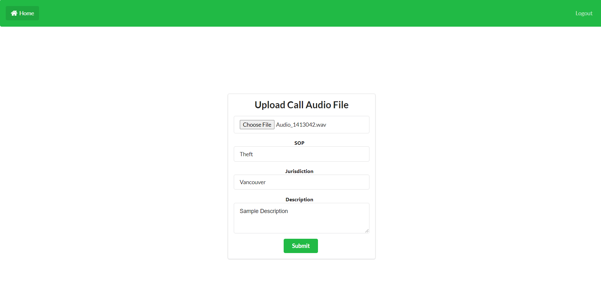

# E-Comm 911 Call Transcriber - Frontend

## Project Overview

A basic frontend that allow uploading audio files with mapped properties and connects to the
Call Transcriber backend. This project was bootstrapped using [Create React App](https://github.com/facebook/create-react-app).



## Deployment

You will need the following resources before deploying:
* [AWS Account](https://aws.amazon.com/account/)
* [GitHub Account](https://github.com)

1) Fork and clone this repository into your Github account.
2) From the AWS Amplify page in the AWS Console, select **Host web app** under the **New app** dropdown, and select 
   Github as the repository option.
3) After authenticating into your Github account, select the forked repository under the repository dropdown. Leave 
   the default branch as is.

4) On the next page, **App build and test settings**, keep the default build settings. You can rename the app name.
5) Select **Create new environment** under the **Select a backend environment** dropdown, and select your AWS Amplify 
   service role in the following dropdown if one exists; if not, Select 'Create new role' and quickly create one using 
   the default settings and refresh the role selection.

6) Review the settings and click **Save and deploy**, and wait for the deployment build to complete, which will take 
   some time.


Within Amplify Console, you should see an auto-generated URL under **Frontend environment** - that is the URL used 
to access the frontend build. You can now create your user accounts and log in via the URL.

## Architecture

Using AWS Amplify, this project has the following configured backend resources:
* [Cognito authentication](https://docs.amplify.aws/lib/auth/getting-started/q/platform/js) featuring user pools
* An S3 bucket configured with [Amplify Storage](https://docs.amplify.aws/lib/storage/overview/q/platform/js) to store 
  audio files, [link to StorageClass documentation](https://aws-amplify.github.io/amplify-js/api/classes/storageclass.html).
  The audio files are deleted in non-debug mode after they have been transcribed and added to the ElasticSearch index.
* GraphQL-based API that writes file metadata to DynamoDB tables in response to file upload events to send it over to 
  the transcribe workflow. These DynamoDB tables managed by the GraphQL Schema are TTL-enabled by 
  importing a [third-party transformer](https://github.com/flogy/graphql-ttl-transformer). \
Metadata can also stored with the S3 object using the Metadata config field in the Amplify.put call, and will 
  have the prefix ```"x-amz-meta-"```.

## Logging in

Cognito is used to authenticate users into the frontend and integrates with Kibana to provide 
authorized access. Users will need to input their email address, name, and a strong password to create an account.
After account creation, users will need to verify their account by inputting the 6-digit verification code that was 
sent to their provided email address before being able to log in to the system.
