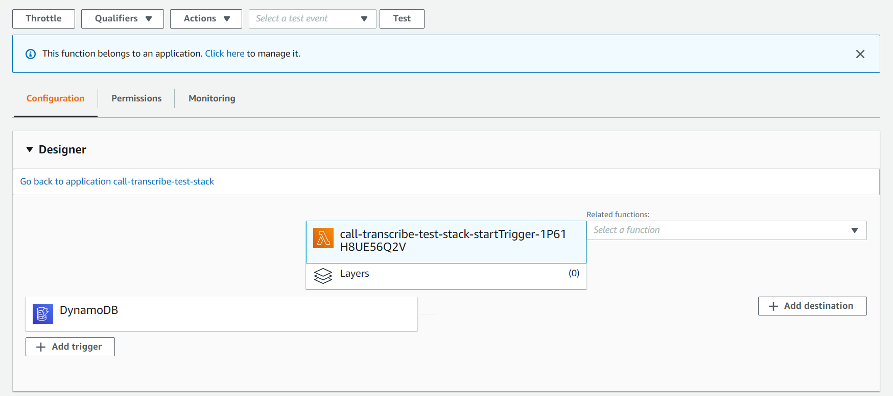
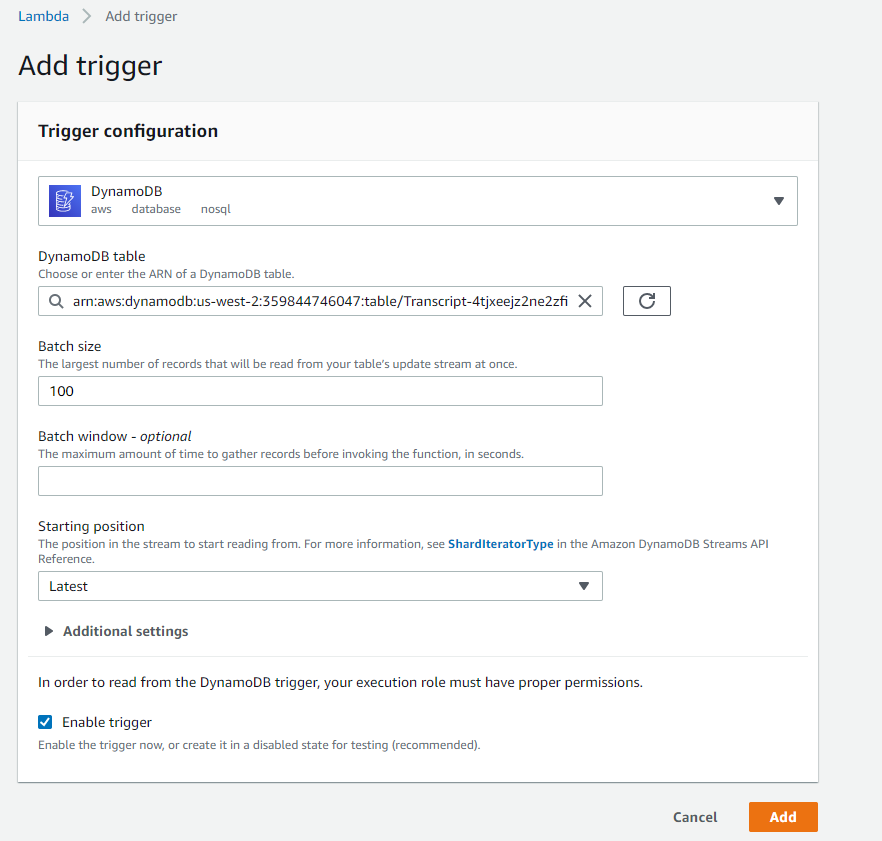
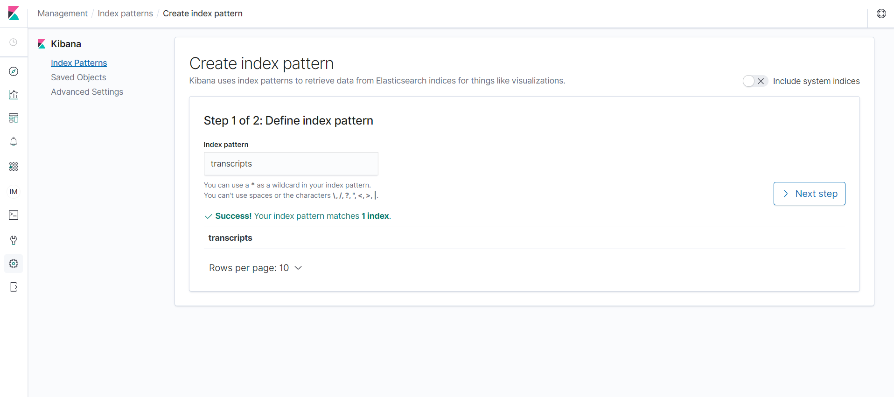
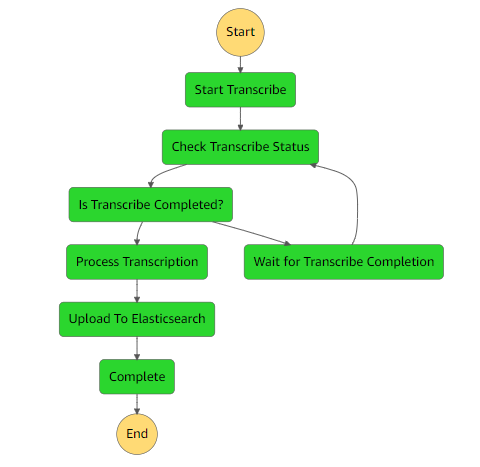

# ECOMM 911 - Audio Call Transcription Flow (Part 1)

## Project Overview

The first half of the ECOMM-911 call center virtual assistant Proof of concept - an application stack that transcribes and provides PII redaction for audio files and their corresponding metadata received from the frontend, and indexes the resulting processed transcripts into an Elasticsearch domain for future querying during ongoing calls. This portion of the solution leverages Amazon Transcribe, Amazon Comprehend, Amazon Elasticsearch, AWS Step Functions and AWS Lambda. Do note that this stack should be deployed first as the realtime call transcription stack with AWS Connect Integration has a dependency on this stack.

## Deployment Steps

Some system requirements before starting deployment:
* AWS SAM installed on your system, details on the installation can be found [here](https://docs.aws.amazon.com/serverless-application-model/latest/developerguide/serverless-sam-cli-install.html).
* Python3.8 installed and added to PATH (you can select this in the installer), download the installer [here](https://www.python.org/downloads/release/python-387/). Run ```pip install wheel``` in the command line if there are any issues with ```sam build``` resolving dependencies.

1) Create an S3 bucket for deployment:
```
aws s3api create-bucket --bucket <YOUR-BUCKET-NAME> --create-bucket-configuration LocationConstraint=<YOUR-REGION> --region <YOUR-REGION>
```
3) Run the following SAM commands in this subdirectory to build and package the application onto the created S3 bucket in the first step:
```
sam build
```
```
sam package --s3-bucket <YOUR-BUCKET-NAME> --output-template-file <TEMPLATE-NAME> --profile <AWS-PROFILE>
```
4) From CloudFormation in the AWS Console, Select **With new resources (standard)** under the **Create Stack** dropdown. Then, select the **Upload a template file** option under **Template Source** and upload the newly generated output template file from AWS SAM.
5) Change the default parameters if needed, and click **Create Change Set** and then **Execute** in the top right corner when the change set is complete to start stack creation. The stack will take some time to finish, due to more time needed creating the Elasticsearch cluster.
6) Follow the next steps after deploying the frontend. Navigate to the Lambda Console and search for the startTrigger lambda function that was created in the stack. Click on **Add Trigger** in the Designer under the **Configurations** Tab:

7) Select **DynamoDB** as the trigger type and select the Transcript table created from frontend deployment from the dropdown. Check off the **Enable trigger** checkbox at the bottom and click **Add** to create the trigger.

8) Now, refer to the [connect stack deployment guide](../connect-virtual-assistant/README.md).

## Accessing Kibana

You can use Kibana as a search and visualization tool for your Elasticsearch cluster that stores the call transcripts. The Kibana access URL and account credentials (specified username from the stack and an auto-generated password) will be found in the Output tab for the CloudFormation stack once deployment is completed.

1) Click on the Kibana URL and use the given credentials to login. Note that you have to specify a new password when logging in for the first time.
2) Click on **Discover** (The compass icon on the left sidebar) and type 'transcripts' in the index pattern field, and this should match the index created in the Elasticsearch cluster. Click on **Create Index Pattern** in the next step.

3) You will be taken to the management screen where you can view all the fields in the ```transcripts``` index. Navigating back to the Discover panel, you will be able to view all the indexed documents and perform queries in the search bar.

## State Machine Architecture

This workflow is designed to integrate with the frontend architecture; invocations of the state machine workflow are tied to changes in the Amplify API, specifically the , which contains metadata for the audio file that was uploaded to Amplify storage. The lambda that has the DynamoDB table created in the frontend assigned to it as a trigger will start the invocation of the state machine. Note that the supported audio file types are: .wav, .mp3, .mp4, and .flac. \
In the 'Start Transcribe' stage, a transcription job for the uploaded audio file will be started with PII redaction enabled and its status will be checked and waited until it finishes. The resulting transcript is available via URI instead of being written to an S3 bucket. In the 'Process Transcription' stage, the transcript will try to be chunked up according to speaker, and will undergo entity and key phrase extraction. Finally, the transcript, phrases and other metadata will be indexed into the ES cluster.

## Further Recommendations

This is a proof of concept for Ecomm 911 done by the UBC CIC. Some suggestions would be that metadata fields of Elasticsearch documents can be updated or enhanced, and the state machine (and subsequently the frontend) may be updated to handle batches of audio files for better scalability. Custom vocabularies containing jargon/buzzwords can be created to help enforce accuracy of AWS Transcribe transcription jobs, but will require more inputs from the frontend and an additional wait loop, depending if a custom vocabulary is to be created for every job.

## Credits

This portion of the proof of concept was based on and modified from the [Amazon Transcribe Comprehend Podcast Project](https://github.com/aws-samples/amazon-transcribe-comprehend-podcast) by the team at the UBC Cloud Innovation Centre.